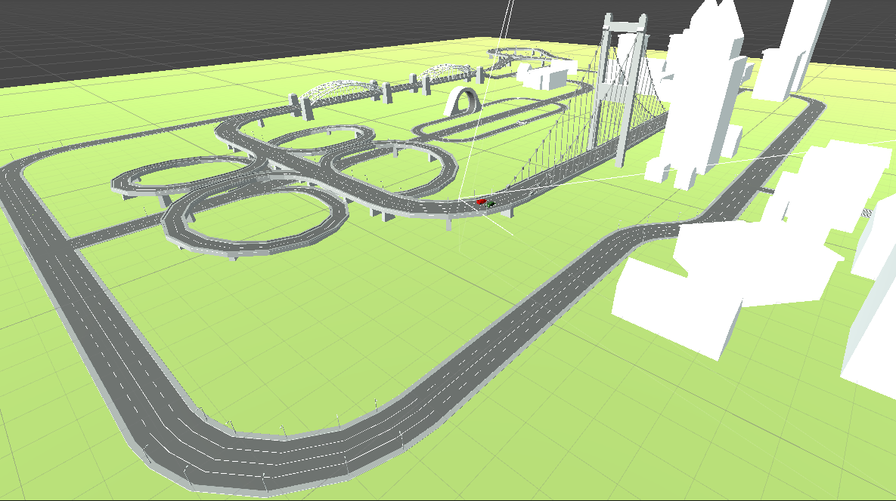
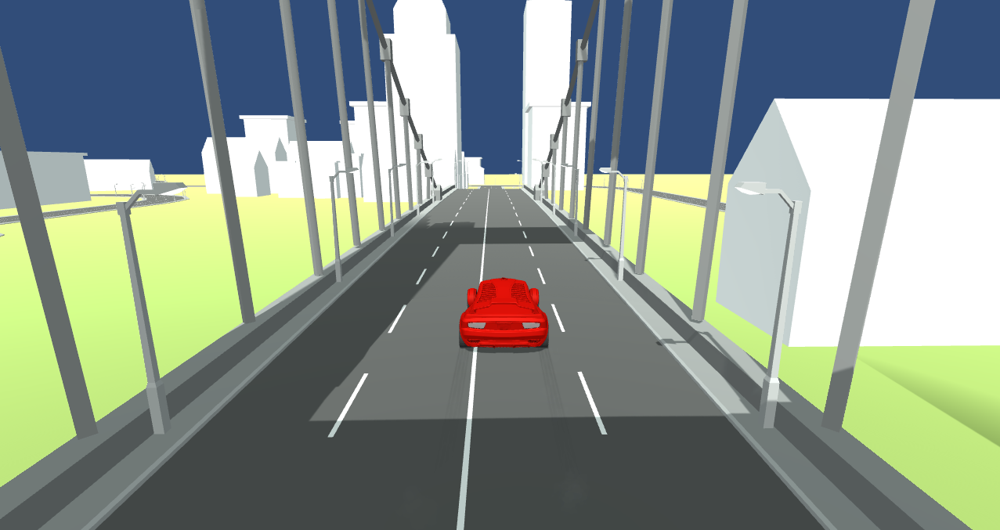
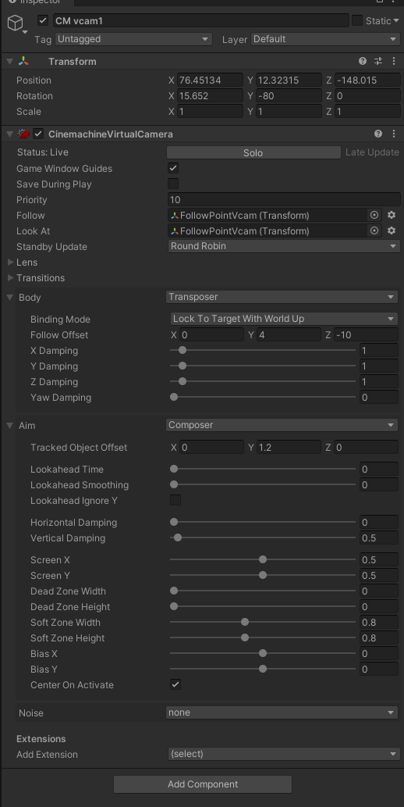
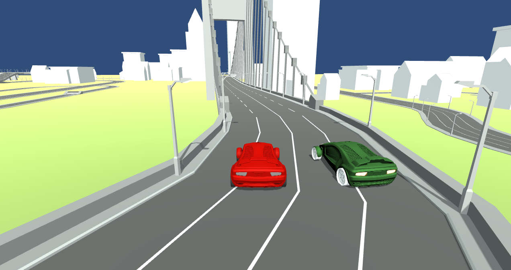

# GamesNPlay

## 3D Car Racing game 

Importing Terrain and building NavMesh

Using the car prefab and modifiying its apperance

Using Cinemachine for Camera 

- First, make sure that have the Cinemachine package installed in the Unity project. It can do this by going to the Package Manager, searching for ["Cinemachine"](https://unity.com/unity/features/editor/art-and-design/cinemachine)  and installing it.

- Next, create an empty GameObject in the scene and rename it to something like "Camera Rig". This will be the parent object for the Cinemachine virtual camera.

- With the Camera Rig selected, go to the Add Component menu and select Cinemachine > Cinemachine Virtual Camera.

- In the Inspector window, you'll see a field called "Follow". Drag the car GameObject into this field to set it as the target for the virtual camera to follow.

- Adjust the settings of the Cinemachine Virtual Camera component to get the desired shot. For example, you can adjust the "Look At" setting to make the camera always point towards the car, or adjust the "Dead Zone" setting to control how much the camera moves when the car turns.

- If you want to add more advanced features like camera shaking or cutscene transitions, you can use other components in the Cinemachine package such as the Cinemachine Noise or Cinemachine State Driven Camera.

- That's it! With these steps, you should now have a Cinemachine virtual camera set up to follow your car in your Unity project. Let me know if you have any further questions or need additional clarification.

Cinemachine Configuration

Implementation of AI Car in the game. 

