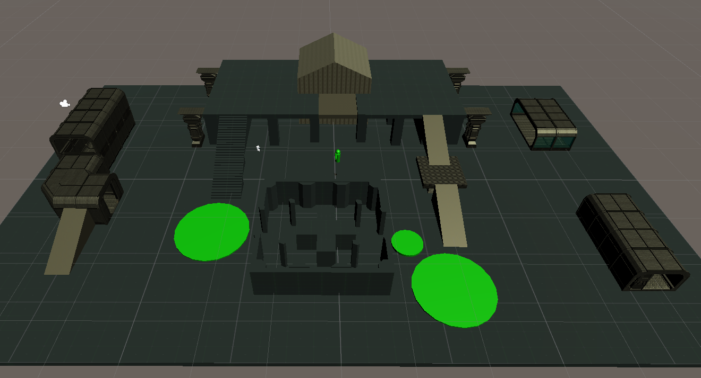
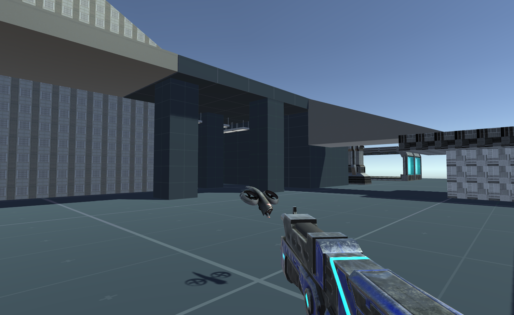

# GamesNPlay
Unity Project for Games n Play class

## First Person Shooter Game

First person Point of View 

-  Importing the gun and setting it as the child of the first person object 
-  Aligning the gun's position into the camera frame
-  Adding the shooting sound upon fire (click)
-  Implementing the bullet hole with the decaf (sprite)

Shooting Arena Full View 

Obstacles and Shooting Arena after importing the assets as prefabs from external library

Adding Enemy Drone

